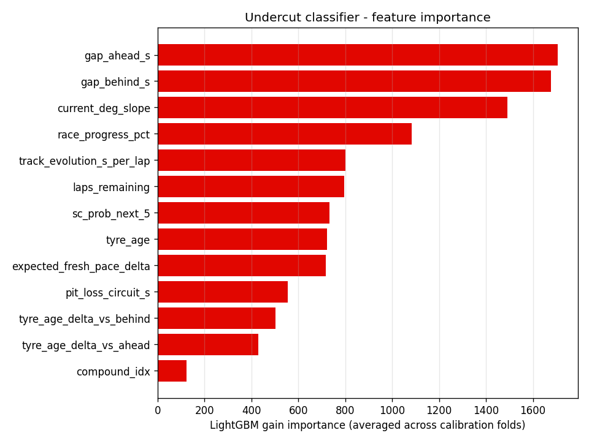
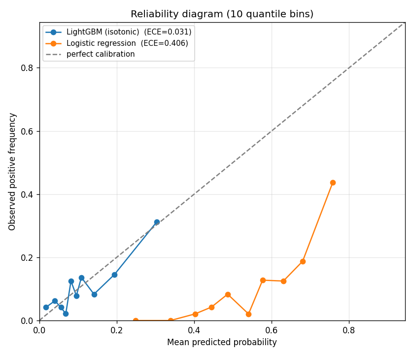

# Model Card — Undercut Success Classifier

## Intended use

Given the current race state at lap N, estimate the probability that pitting now will result in net positions gained within the next 5 laps, vs. staying out.

**Intended consumers:** race strategists, broadcasters, fantasy/betting analytics, fans.
**Out of scope:** predicting race winners, predicting incidents, pace beyond a 5-lap horizon.

## Model comparison (the table that matters)

All metrics are on a **GroupShuffleSplit**(`(year, round_num)`) holdout with **63 train races and 21 test races, zero race overlap**. 5-fold GroupKFold CV reported below for the calibrated LightGBM.

| Model | AUC | Brier | Log loss |
|---|---|---|---|
| Constant (predict base rate 0.106) | 0.500 | 0.0937 | 0.335 |
| Threshold rule (`tyre_age >= 15`) | 0.407 | 0.234 | 0.669 |
| Logistic regression (class-weighted) | **0.821** | 0.249 | 0.693 |
| **LightGBM (isotonic calibrated)** | 0.687 | **0.0882** | **0.313** |
| 5-fold GroupKFold AUC | 0.690 ± 0.043 | — | — |

**Read this:**
- The LightGBM beats the constant baseline by 0.5 Brier points — meaningful but small. This is honest small-effect ML.
- The logistic regression is a better ranker (AUC 0.82) but a worse probabilistic model (Brier 0.25 vs. constant 0.094 — calibration is destroyed by `class_weight="balanced"`).
- The threshold rule is anti-predictive (AUC 0.41). Older tyres correlate with later race phases when undercuts are mechanically harder.

## Model details

- **Algorithm:** LightGBM (400 trees, lr=0.05, num_leaves=31)
- **Calibration:** Isotonic regression, 5-fold CV via `CalibratedClassifierCV`
- **Library:** `lightgbm==4.x`, `scikit-learn==1.x`

## Features (all real, no hardcoded constants)

All 13 features are derived from `fact_lap` by `src/pitwall/features/undercut.py`. See methodology doc for the SQL/Python expressions.

| # | Feature | Source |
|---|---|---|
| 1 | `gap_ahead_s` | `cumsum(LapTimeSeconds)` join on `(position - 1)` at the pit lap |
| 2 | `gap_behind_s` | same, position + 1 |
| 3 | `tyre_age` | `StintPosition` at pit lap |
| 4 | `tyre_age_delta_vs_ahead` | tyre_age − ahead.StintPosition at the same lap |
| 5 | `tyre_age_delta_vs_behind` | same, vs behind |
| 6 | `compound_idx` | ordinal SOFT=0 / MEDIUM=1 / HARD=2 / INTER=3 / WET=4 |
| 7 | `current_deg_slope` | OLS slope over last 5 clean laps of current stint |
| 8 | `expected_fresh_pace_delta` | `DegradationModel.predict_delta(compound, circuit, tyre_age)` |
| 9 | `laps_remaining` | total_laps_in_race − pit_lap |
| 10 | `race_progress_pct` | pit_lap / total_laps |
| 11 | `sc_prob_next_5` | empirical share of non-green laps per circuit |
| 12 | `pit_loss_circuit_s` | median `pit_loss_s` from `fact_pit_stop` for this circuit |
| 13 | `track_evolution_s_per_lap` | median per-driver lap-over-lap slope in race quarter-1 |

## Feature importance



Top 5 by LightGBM gain (averaged across 5 calibration folds):

1. `gap_ahead_s` (1,706)
2. `gap_behind_s` (1,678)
3. `current_deg_slope` (1,492)
4. `race_progress_pct` (1,083)
5. `track_evolution_s_per_lap` (802)

The fact that the four newly-engineered features (gap_ahead, gap_behind, deg_slope, track_evolution) dominate validates the feature pipeline. Earlier drafts had these as hardcoded constants and the model was effectively 5-dimensional.

## Calibration



10-bin reliability diagram on the test set:
- **LightGBM ECE: 0.031** — predicted probabilities track observed frequencies well.
- **Logistic regression ECE: 0.406** — class-weighted LR is badly miscalibrated, even though its AUC is higher.

## Training data

- **85 races across 2020, 2021, 2023, 2024.** 2022 fails on FastF1's data source for this season; documented as a known gap.
- 1,861 historical green-flag pit stops total, 10.6% positive base rate.
- 75/25 group-aware split by race; 5-fold GroupKFold CV for stability estimate.

## Known limitations

- **Survivor bias** — train only on stops that actually happened; counterfactual stops (the ones strategists *didn't* take) are missing.
- **No driver-specific residual.** Hamilton and Pérez tyre management isn't modelled.
- **2022 missing.** FastF1 returns `DataNotLoadedError` for this season; loader has a known gap.
- **Wet-race weakness.** Stints with wet-to-dry transitions produce unreliable `current_deg_slope` features.

## Ethical considerations

This model uses only publicly available data and is not a tool for unauthorized access to team-proprietary systems. Outputs are advisory and explicitly probabilistic.

## Reproducibility

```bash
uv run python scripts/train_and_validate.py
```

Writes:
- `data/processed/model_comparison.json`
- `data/processed/undercut_classifier.joblib`
- `data/processed/mlruns/` (MLflow run)
- `docs/model_cards/figures/calibration.png`
- `docs/model_cards/figures/feature_importance.png`
